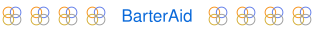

# Hi there 👋

<h3> My name is Andy White, I like to build things and learn new technologies. I have experience with Javascript, React/Redux, Next.js, Tailwind, Zustand, Node/Express, and SQL/NoSQL/Redis databases </h3>
 

## Check out my work!

[✨🌐✨ Visit My Portfolio ✨🌐✨](https://comfyclicks.com)

<a href="https://barteraid.com">
  <picture>
    <source media="(prefers-color-scheme: dark)" srcset="./assets/barteraid-link-dark.svg">
    
  </picture>
</a>

🥐 🍩  🍪 ☕️ 🥐 [Comfy Cafe](https://comfyclicks.github.io/Comfy-Cafe/) 🧁 🍩  🍪 ☕️ 🧁

🚀  🎲  🎮  ✨ [Tic-Tac-Toe](https://comfyclicks.github.io/Tic-Tac-Toe/) ✨  🎮  🎲  🚀

📚 🤓 📚 [Library App](https://comfyclicks.github.io/Library-App/) 📚 🤩 📚

🪨 📄 ✂️ [Rock Paper Scissors](https://comfyclicks.github.io/Rock-Paper-Scissors/) ✂️ 📄 🪨

 
 

